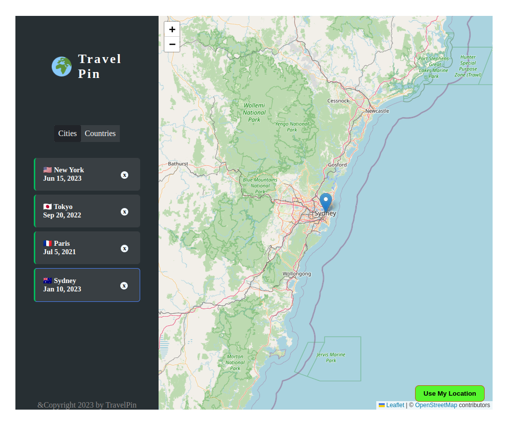

# Travel Pin
An App that keeps track of your visited places around the world.

# About

**Travel Pin** is a web application written in React with Simple Json-Server as Database.

It stores and displays all your visited location around the world using an Interactive map.

With this app, you can easily keep track of your travel experiences and visually see the places you've explored.


## Setup Guide
### Prerequisites

- Node.js: Make sure you have Node.js installed. You can download it from [nodejs.org](https://nodejs.org/).

### Installation

1. **Clone Repository:** Start by cloning this repository to your local machine using the following command:
	```bash
	git clone https://github.com/raquib01/travel-pin.git
	```

2. Navigate to root directory
	```bash
	cd travel-pin
	```
 
3. **Install Dependencies:** Install the project dependencies using npm (Node Package Manager):
	```bash
	npm install
	```
 
4. **Start json-server:** Open a new terminal window and navigate to the project directory if you're not already there. Then, start the json-server to simulate a backend:
	```bash
	npm run server
	```
 
5. **Start the React App:** In another terminal window, navigate to the project directory if you're not already there and start the React app:

	```bash
	npm run dev
	```

6. **Access the App:** Open your web browser and go to **`http://localhost:5173`** to see and interact with the Travel Pin App.


# Screenshot


## Technologies Used

- React
- json-server
- Leaflet (for maps)

## Credits

This app was created by [Raquib Khan](https://github.com/raquib01). You can find the source code on [GitHub](https://github.com/raquib01/travel-pin).

## License

This project is licensed under the `MIT License`
